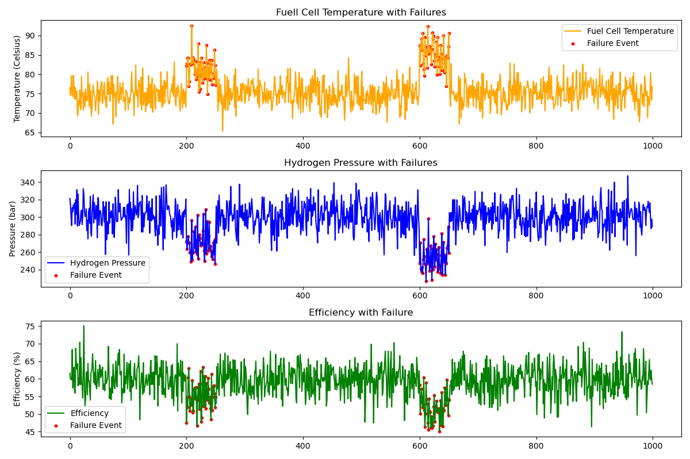
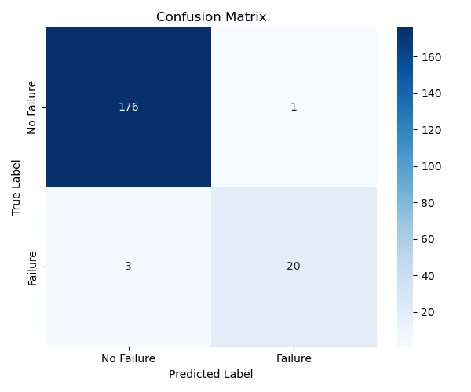
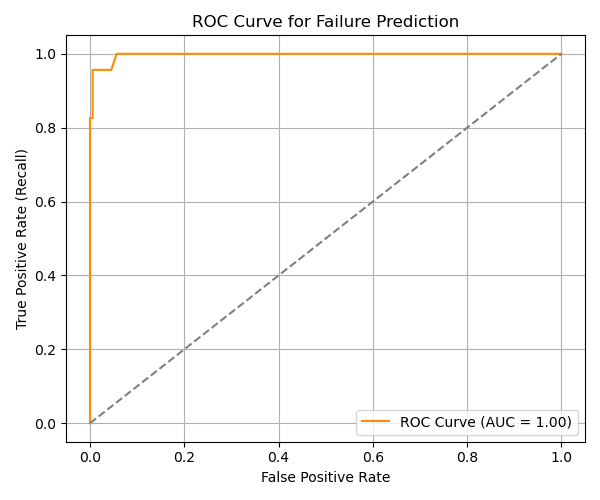
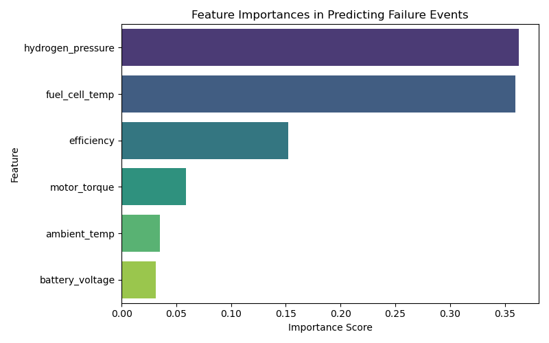

# Hydrogen Locomotive Fuel Cell Fault Prediction

This project builds a machine learning pipeline to detect system failures in a **hydrogen-powered locomotive** using simulated sensor data.

Built with `pandas`, `scikit-learn`, `matplotlib`, and `seaborn`, it demonstrates how predictive maintenance can improve safety and reliability in clean energy transportation.

---

## Objective

To train a **binary classifier** that identifies both **mild** and **severe** system failures based on:

- Hydrogen Pressure  
- Fuel Cell Temperature  
- System Efficiency  

---

## Dataset & Failure Simulation

- Simulated ~1000 time steps of telemetry data.
- Labeled a new column `failure_event` (1 = failure, 0 = normal).
- Injected two failure zones:

| Row Range | Type of Failure | Description |
|-----------|-----------------|-------------|
| 200–235   | Mild            | Small efficiency drop, slight temp spike |
| 600–650   | Severe          | Sharp pressure drop, high temp spike, efficiency loss |

---

## Simulated Failure Signals

Combined plot of how fuel cell variables behave across time, with visible injected anomalies:

  

---

## Model Training

Trained a `RandomForestClassifier` with `class_weight='balanced'` to prioritize recall on rare failure events.

Used `train_test_split` with 20% test size and applied GridSearchCV to tune:

- `n_estimators`: [100, 200]  
- `max_depth`: [None, 10, 20]  
- `min_samples_split`: [2, 5]  
- `class_weight`: [None, 'balanced', {0:1, 1:3}]

---

## Results

### Confusion Matrix

  

The model predicted 20 out of 23 failures.

### ROC Curve

  

## Feature Importance

 
   

fuel_cell_temp had the strongest influence on predictions, followed by hydrogen_pressure and efficiency — matching failure patterns.
---

### Classification Report

| Metric      | Class 0 (Normal) | Class 1 (Failure) |
|-------------|------------------|-------------------|
| Precision   | 0.983             | 0.952              |
| Recall      | 0.994             | 0.870              |
| F1-Score    | 0.989             | 0.909              |

> *Strong model performance, with high recall on failure events despite limited and imbalanced failure data.*

---

## 🔧 Next Steps

- Add **realistic noise** and drift to sensor values  
- Introduce **random failure zones**  
- Test with **imbalanced datasets**  
- Try alternative models: `XGBoost`, `LSTM`, `IsolationForest`

---

## Key Skills Demonstrated

- Time-series anomaly simulation  
- Binary classification & recall optimization  
- Data preprocessing and feature engineering  
- Model tuning with `GridSearchCV`  
- Interpretability via `confusion_matrix`, `ROC`, `AUC`  
- Visualization using `Matplotlib` & `Seaborn`

---

